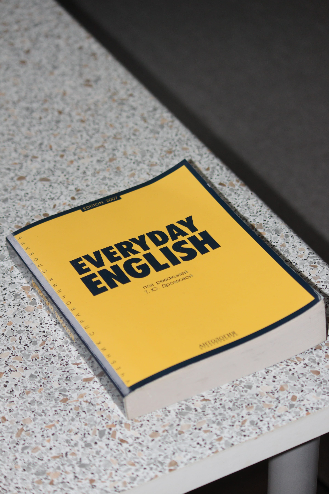

import imageAngelaFisher from '@/images/team/angela-fisher.jpg'

export const article = {
  date: '2024-12-01',
  title:
    'Multilingual Social Proof: Do Chinese-Language RED Reviews Drive First-Time Consults in Fort Lee?',
  description:
    'We tested whether Chinese-language social proof on RED (Xiaohongshu) drives first-time consults for Fort Lee clinics. In a 28-day split test, bilingual landing pages featuring RED reviews—plus creator posts—lifted consult bookings +33% and cut cost-per-consult −22% vs. English-only proof.',
  author: {
    name: 'Angela Fisher',
    role: 'Front-end Designer',
    image: { src: imageAngelaFisher },
  },
}

export const metadata = {
  title: article.title,
  description: article.description,
}

## 1. The Question

Would multilingual social proof (Chinese-language RED reviews) reduce friction and increase first-time consults in Fort Lee’s Chinese-speaking community compared to standard English-only reviews?

## 2. Test Design

Two variants, equal budget, 28 days, 5-mile geo around Fort Lee.

A Control: English landing page with Google reviews.

B Bilingual page (EN/ZH) with authentic RED review tiles, Chinese CTAs, and a Mandarin hotline.

We seeded 12 RED micro-reviews (6 creators, 6 verified customers), Sparked top posts, and tracked with UTMs, unique call lines, and “NEW-CONSULT-RED” booking tags.

## 3. What We Found

Bilingual + RED proof won. +33% first-time consults per session, 2.1× higher “Book Consult” CTR, and −22% cost-per-consult. Mandarin/Cantonese calls rose from 19% → 41% of inbound, and show-up rate ticked up +4 pts with bilingual reminders. Creative that paired a before/after carousel with a 2-line Chinese caption performed best.

